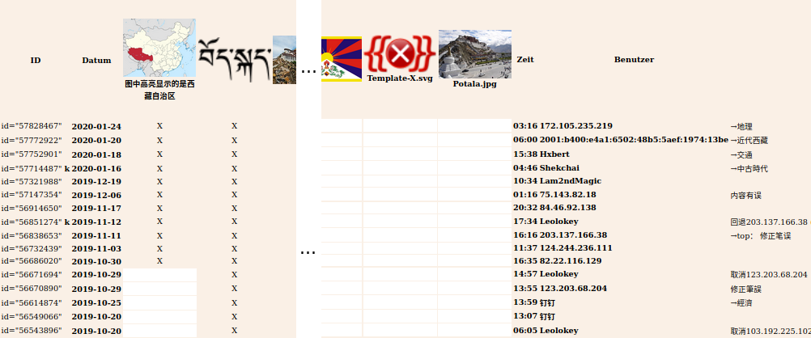

# Quellenauswertung

## Grundlagen

- Versionskontrolle bei mediawiki

## Methodik

- Bilder als gut zu identifizierende Informationsträger

- addressierung technischer Elemente wie Bildern im Mediawiki stets in lateinischen buchstaben bzw durch entsprechende tags

  - dadurch automatisiertes zusammentragen möglich
  - keine sprachkenntnisse in chinesisch benötigt

## <a name="exemplarischer-ablauf">Exemplarischer Ablauf</a>

Die im Folgenden genannten Skripte finden sich im Unterordner [~/Skripte](./Skripte) und sind in der zugehörigen ReadMe-Datei sowie im Quelltextkommentar ausführlich beschrieben. Weiterhin ist dort der idealtypische Ablauf des Datenabraufs in aller Kürze dargestellt.

Als Beispiel soll der Artikel zur [Autonomen Region Tibet](https://zh.wikipedia.org/wiki/%E8%A5%BF%E8%97%8F%E8%87%AA%E6%B2%BB%E5%8C%BA) dienen. [? Um trotz mangelnder Sprachkenntnisse zumindest einen ersten Überblick zu bekommen und zielgerichteter auf der Seite navigieren zu können, sei die Verwendung des Chrome-Browsers empfohlen, da dieser eine automatische Übersetzung der Seiteninhalte anbietet. Da die tatsächliche Qualität der Übersetzung jedoch nur schwer abzuschätzen ist, sollte diese Übersetzung jedoch nicht für die inhaltliche Auswertung herangezogen werden.] Die [Artikelhistorie](https://zh.wikipedia.org/w/index.php?title=%E8%A5%BF%E8%97%8F%E8%87%AA%E6%B2%BB%E5%8C%BA&action=history) zeigt beim ersten Aufruf nur die letzten 50 Versionen. Um die vollständige Versionsgeschichte zu beziehen, muss deshalb der Parameter `limit` auf einen ausreichend hohen Wert gesetzt werden. Da selbst sehr häufig editierte Artikel selten über 10.000 Versionen kommen, ist ein Wert von 50.000 eine sichere Wahl. Die URL sähe dann wie folgt aus:

```URL
https://zh.wikipedia.org/w/index.php?title=%E8%A5%BF%E8%97%8F%E8%87%AA%E6%B2%BB%E5%8C%BA&limit=50000&action=history
```

Mit dieser parametrisierten URL wird nun das Skript `getArticles.sh` aufgerufen. Da URLs Steuerzeichen enthalten können, sollte die URL in Anführungszeichen übergeben werden. Über den Parameter `-v` setzen wir das Arbeitsverzeichnis *tibet* und über die Parameter `-b` und `-e` definieren wir den Zeitraum der abzurufenden Daten. Da der Artikel zur Autonomen Region Tibet im April 2003 angelegt wurde, definieren wir den Zeitraum zwischen 2003 und heute, um alle Artikelversionen mit einzuschließen. Die Notation der Datumsangaben folgt dabei dem Schema `YYYYMMDDhhmm`. Der Aufruf sieht somit wie folgt aus:

```bash
sh getArticles.sh -u 'https://zh.wikipedia.org/w/index.php?title=%E8%A5%BF%E8%97%8F%E8%87%AA%E6%B2%BB%E5%8C%BA&limit=50000&action=history' -v tibet -b 200304010000 -e 202002200000
```

Nachdem das Skript erfolgreich durchgelaufen ist, finden sich im Arbeitsverzeichnis fünf Dateien:

- articleData.xml - Hier sind alle Artikelversionen kumuliert gespeichert. Da die potentielle Datenmenge je nach Artikel sehr groß ist, wird ab 200 MB Dateigröße eine neue Datei mit angehangenem Zähler angelegt.
- articleData_log.txt - In dieser Logdatei ist der Verlauf des Datenabrufs dokumentiert. Eventuelle Fehlermeldungen werden ebenfalls gespeichert.
- historyData.html - Dies eine Kopie der über die URL abgefragten Versionsgeschichte-Webseite.
- historyData.xml - Diese Datei enthält die Versionsinformationen der historyData.html in einem XML-Schema.
- historyData_log.txt - In dieser Logdatei ist der Abruf und die Transformation der Versionsgeschichte dokumentiert.

Nachdem die Logdateien auf Fehler überprüft wurden, wird als nächstes das Skript `getImages.sh` ausgeführt. Das Skript ermittelt sämtliche Bilder aus allen Versionen des Artikels und schreibt diese strukturiert in eine XML-Datei. Hierzu greift es auf die Daten in articleData.xml zu; sollten mehrere derartige Dateien im Arbeitsverzeichnis liegen, werden diese nacheinander ausgewertet.

```bash
sh getImages.sh -v tibet
```

Nach dem erfolgreichen Durchlauf, finden sich zwei weitere Dateien im Arbeitsverzeichnis:

- imageData.xml - In dieser XML-Datei sind alle Artikelversionen mit allen dort verzeichneten Bildern gespeichert.
- imageData_log.txt - In dieser Logdatei ist die Auswertung der Artikeldaten dokumentiert.

[ Bei sehr großen Datenmengen kann es nötig sein, die articleData.xml in mehreren Schritten auszuwerten. Die dabei erzeugten imageData.xml können anschließend über das Schema `combineImages.xsl` zusammengefügt werden. Siehe hierzu die [entsprechende Dokumentation](./Skripte/README.md#combineimages-xsl). ]

Schließlich soll diese Aufstellung von Artikeldaten zu Bilddaten in eine menschenlesbare Form gebracht werden. Das Skript `getImageTables.sh` erzeugt aus diesen Daten daher eine HTML-Tabelle, in der in der Kopfzeile alle verwendeten Bilder gezeigt werden und diese allen Artikelversionen gegenübergestellt werden. Der Aufruf ähnelt dem der `getImages.sh`, jedoch wird hier zusätzlich der Parameter `-n` gesetzt, damit keine erneute Transformation der Artikeldaten ausgelöst wird.

```bash
sh getImageTable.sh -v tibet -n
```

Das Ergebnis dieses Prozesses sind die folgenden beiden Dateien:

- imageTable_log.txt - In dieser Logdatei ist die Auswertung der imageData.xml zur imageTable.html dokumentiert.
- imageTable.html - In dieser HTML-Datei ist die Tabelle zur Quellenauswertung abgelegt.



> Screenshot der Datei imageTable.html (Auszug) des Artikels Autonome Region Tibet, bearbeitet, 20.02.2020.

In den ersten beiden Spalten der Tabelle finden sich die ID der einzelnen Versionen und das Datum der Version. Über die ID kann die Version eindeutig identifiziert und aufgerufen werden. Wenn die Version als *kleine Änderung* vermerkt wurde, ist hinter der ID ein *k* notiert. Es folgen die Spalten für die Bilder des Artikels. Die Anzahl ist je nach Artikel und untersuchtem Zeitraum unterschiedlich. Vermeintliche Dopplungen sind regelmäßig zu beobachten, jedoch handelt es sich dabei technisch um unterschiedliche Bilder. Der Algorithmus unterscheidet die Bilder nach ihrer URL; Sobald also ein Bild durch eine Variation (zum Beispiel durch ein Bild mit reduzierter Größe) des selben Bildes ersetzt wird, werden in der Tabelle beide Bilder angezeigt. Die letzten Spalten zeigen den Zeitpunkt des Eintrages, den verantwortlichen Benutzer bzw. IP-Adresse sowie eventuelle Kommentare zur Version. Wenn ein Bild in einer Version vorkommt, dann ist dies durch ein *x* markiert, zudem ist die betreffende Zelle farblich hinterlegt. Über diese Markierungen lassen sich die Verläufe der Bildzuordnungen über längere Zeiträume nachvollziehen.

## Erläuterung der Quelleneditionen / Artikel-README

- Aufbau
- Maßstäbe etc.
```

```
